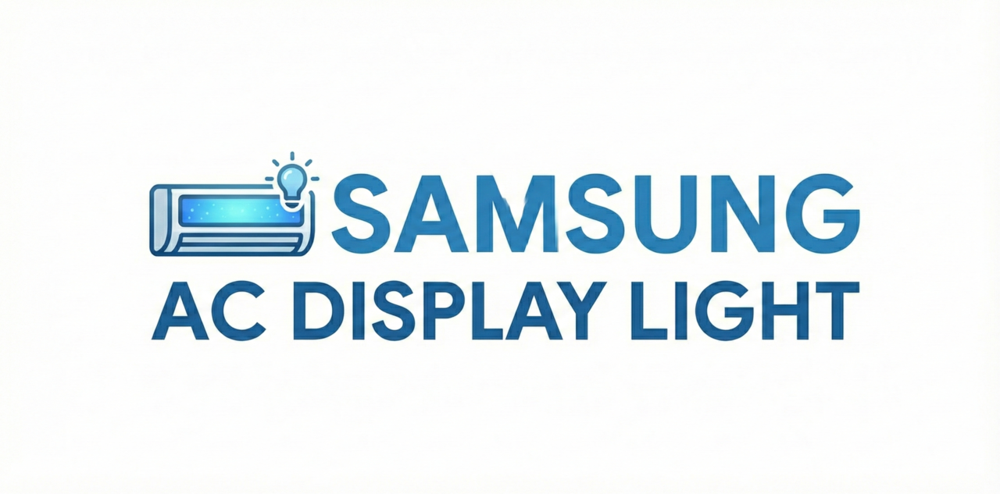

# Samsung AC Display Light (Home Assistant)

  

Integração personalizada para controlar o LED/display de aparelhos de ar-condicionado Samsung via **SmartThings Cloud API**.

Custom integration to control the LED/display of Samsung air conditioners via **SmartThings Cloud API**.

---

## ✨ Funcionalidades | Features

- Liga/desliga o display (LED)
- Estado real (não otimista)
- Sincroniza mudanças feitas pelo controle remoto
- Compatível com automações
- Usa DataUpdateCoordinator (menos requisições / evita 429)
- Configuração 100% pela interface do Home Assistant (Config Flow)

---

## 📦 Instalação (HACS) | Installation (HACS)

1. Adicione este repositório como **Custom Repository**
2. Tipo: **Integration**
3. Instale a integração
4. Reinicie o Home Assistant

---

## ⚙️ Configuração | Configuration

### Pela Interface (Config Flow)

1. Vá em **Configurações → Dispositivos e Serviços**
2. Clique em **Adicionar integração**
3. Procure por **Samsung AC Display Light**
4. Informe:
   - **SmartThings Personal Access Token**
   - Selecione o **ar-condicionado desejado**
5. Conclua a configuração

Nenhuma edição em `configuration.yaml` é necessária.

No `configuration.yaml` changes are required.

---

## 🔁 Sincronização de Estado | State Sync

- Alterações feitas pelo **controle remoto** são refletidas automaticamente no Home Assistant
- O estado do switch sempre reflete o estado real do dispositivo

---

## 🧠 Arquitetura | Architecture

- SmartThings Cloud API
- DataUpdateCoordinator
- Config Flow (UI-first)
- Switch platform

---

## 🛠️ Próximas melhorias | Planned Improvements

- Debounce e rate limit inteligente
- Expor controles adicionais:
  - Beep
  - Quiet
  - WindFree
- Opção: desligar LED automaticamente ao ligar o ar

---

## ⚠️ Observações | Notes

- Requer conexão com a internet
- Pode haver limites de requisição impostos pela SmartThings API

---

## 📄 Licença | License

MIT